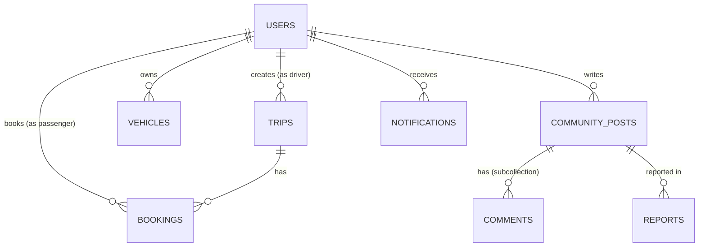

# 🗄️ FIREBASE DATABASE DESIGN — Smart Carpool Connect

> **Database:** Cloud Firestore  
> **Project:** Smart Carpool Connect  
> **Ngày tạo:** 18/05/2026

---

## 📊 Entity Relationship Diagram



---

## 📦 COLLECTIONS

### 1. `users` — Người dùng

| Field | Type | Required | Mô tả |
|-------|------|----------|-------|
| `id` | `string` | ✅ | = Firebase Auth UID |
| `fullName` | `string` | ✅ | Họ tên |
| `email` | `string` | ✅ | Email đăng nhập |
| `phone` | `string` | ✅ | Số điện thoại |
| `avatarUrl` | `string?` | ❌ | URL ảnh đại diện (Firebase Storage) |
| `rating` | `number` | ✅ | Đánh giá trung bình (1.0-5.0), default: 5.0 |
| `totalTrips` | `number` | ✅ | Tổng số chuyến đã đi, default: 0 |
| `totalKm` | `number` | ✅ | Tổng km đã đi, default: 0 |
| `role` | `string` | ✅ | `'passenger'` / `'driver'` / `'both'` |
| `isVerified` | `boolean` | ✅ | Đã xác minh CMND/CCCD chưa |
| `createdAt` | `timestamp` | ✅ | Thời điểm tạo tài khoản |

```json
// Ví dụ document: users/{uid}
{
  "id": "abc123",
  "fullName": "Nguyễn Văn A",
  "email": "a@gmail.com",
  "phone": "0901234567",
  "avatarUrl": null,
  "rating": 4.8,
  "totalTrips": 15,
  "totalKm": 320,
  "role": "both",
  "isVerified": true,
  "createdAt": "2026-05-01T08:00:00Z"
}
```

---

### 2. `trips` — Chuyến đi

| Field | Type | Required | Mô tả |
|-------|------|----------|-------|
| `id` | `string` | ✅ | Auto-generated document ID |
| `driverId` | `string` | ✅ | UID tài xế (ref → users) |
| `driverName` | `string` | ✅ | Tên tài xế (denormalized) |
| `driverAvatar` | `string` | ❌ | Avatar tài xế (denormalized) |
| `driverRating` | `number` | ✅ | Rating tài xế (denormalized) |
| `vehicleName` | `string` | ✅ | Tên xe (VD: "Toyota Vios") |
| `licensePlate` | `string` | ✅ | Biển số xe |
| `vehicleType` | `string` | ✅ | `'car'` / `'motorbike'` |
| `pickupLocation` | `string` | ✅ | Điểm đón |
| `dropoffLocation` | `string` | ✅ | Điểm trả |
| `pickupTime` | `string` | ✅ | Giờ đón (VD: "07:30 - 18/05") |
| `dropoffTime` | `string` | ❌ | Giờ trả dự kiến |
| `pricePerSeat` | `number` | ✅ | Giá mỗi ghế (VNĐ) |
| `totalSeats` | `number` | ✅ | Tổng ghế ban đầu |
| `availableSeats` | `number` | ✅ | Ghế còn trống |
| `driverNote` | `string?` | ❌ | Ghi chú của tài xế |
| `status` | `string` | ✅ | `'available'` / `'full'` / `'completed'` / `'cancelled'` |
| `createdAt` | `timestamp` | ✅ | Thời điểm tạo |

```json
// Ví dụ: trips/{tripId}
{
  "id": "trip_001",
  "driverId": "abc123",
  "driverName": "Nguyễn Văn A",
  "driverAvatar": "",
  "driverRating": 4.8,
  "vehicleName": "Toyota Vios",
  "licensePlate": "51A-123.45",
  "vehicleType": "car",
  "pickupLocation": "ĐH Bách Khoa TP.HCM",
  "dropoffLocation": "Quận 7, TP.HCM",
  "pickupTime": "07:30 - 19/05",
  "dropoffTime": "08:15 - 19/05",
  "pricePerSeat": 25000,
  "totalSeats": 3,
  "availableSeats": 2,
  "driverNote": "Có điều hòa, đi đúng giờ",
  "status": "available",
  "createdAt": "2026-05-18T10:00:00Z"
}
```

---

### 3. `bookings` — Đặt chỗ

| Field | Type | Required | Mô tả |
|-------|------|----------|-------|
| `id` | `string` | ✅ | Auto-generated |
| `tripId` | `string` | ✅ | ref → trips |
| `passengerId` | `string` | ✅ | UID hành khách (ref → users) |
| `passengerName` | `string` | ✅ | Tên (denormalized) |
| `passengerAvatar` | `string` | ❌ | Avatar (denormalized) |
| `seatsBooked` | `number` | ✅ | Số ghế đã đặt |
| `totalPrice` | `number` | ✅ | = seatsBooked × pricePerSeat |
| `status` | `string` | ✅ | `'pending'` / `'confirmed'` / `'cancelled'` / `'completed'` |
| `driverRating` | `number?` | ❌ | Passenger đánh giá tài xế (1-5) |
| `cancelReason` | `string?` | ❌ | Lý do hủy |
| `cancelledAt` | `timestamp?` | ❌ | Thời điểm hủy |
| `passengerRating` | `number?` | ❌ | Passenger đánh giá driver (1-5) |
| `ratingComment` | `string?` | ❌ | Nhận xét kèm đánh giá |
| `ratedAt` | `timestamp?` | ❌ | Thời điểm đánh giá |
| `createdAt` | `timestamp` | ✅ | Thời điểm đặt |

---

### 4. `vehicles` — Phương tiện

| Field | Type | Required | Mô tả |
|-------|------|----------|-------|
| `id` | `string` | ✅ | Auto-generated |
| `ownerId` | `string` | ✅ | UID chủ xe (ref → users) |
| `name` | `string` | ✅ | Tên xe (VD: "Honda Wave") |
| `licensePlate` | `string` | ✅ | Biển số |
| `type` | `string` | ✅ | `'car'` / `'motorbike'` |
| `color` | `string` | ✅ | Màu xe |
| `seats` | `number` | ✅ | Số chỗ ngồi |
| `isDefault` | `boolean` | ✅ | Xe mặc định? |
| `createdAt` | `timestamp` | ✅ | Thời điểm thêm |

---

### 5. `community_posts` — Bài đăng cộng đồng

| Field | Type | Required | Mô tả |
|-------|------|----------|-------|
| `id` | `string` | ✅ | Auto-generated |
| `authorId` | `string` | ✅ | UID tác giả (ref → users) |
| `authorName` | `string` | ✅ | Tên (denormalized) |
| `authorAvatar` | `string?` | ❌ | Avatar (denormalized) |
| `content` | `string` | ✅ | Nội dung bài đăng |
| `topic` | `string` | ✅ | `'all'` / `'tips'` / `'help'` / `'share'` |
| `likes` | `number` | ✅ | Số lượt thích, default: 0 |
| `comments` | `number` | ✅ | Số bình luận, default: 0 |
| `likedBy` | `array<string>` | ✅ | Danh sách UID đã like |
| `createdAt` | `timestamp` | ✅ | Thời điểm đăng |

#### Subcollection: `community_posts/{postId}/comments`

| Field | Type | Required | Mô tả |
|-------|------|----------|-------|
| `id` | `string` | ✅ | Auto-generated |
| `authorId` | `string` | ✅ | UID người bình luận |
| `authorName` | `string` | ✅ | Tên (denormalized) |
| `content` | `string` | ✅ | Nội dung bình luận |
| `createdAt` | `timestamp` | ✅ | Thời điểm bình luận |

---

### 6. `notifications` — Thông báo *(MỚI)*

| Field | Type | Required | Mô tả |
|-------|------|----------|-------|
| `id` | `string` | ✅ | Auto-generated |
| `userId` | `string` | ✅ | UID người nhận (ref → users) |
| `type` | `string` | ✅ | `'booking_new'` / `'booking_cancel'` / `'trip_cancel'` / `'rating'` / `'community'` |
| `title` | `string` | ✅ | Tiêu đề thông báo |
| `body` | `string` | ✅ | Nội dung thông báo |
| `relatedId` | `string?` | ❌ | ID liên quan (tripId / bookingId / postId) |
| `isRead` | `boolean` | ✅ | Đã đọc chưa, default: false |
| `createdAt` | `timestamp` | ✅ | Thời điểm tạo |

---

### 7. `reports` — Báo cáo vi phạm

| Field | Type | Required | Mô tả |
|-------|------|----------|-------|
| `id` | `string` | ✅ | Auto-generated |
| `postId` | `string` | ✅ | ID bài bị báo cáo |
| `reporterId` | `string` | ✅ | UID người báo cáo |
| `reason` | `string` | ✅ | Lý do báo cáo |
| `status` | `string` | ✅ | `'pending'` / `'reviewed'` / `'resolved'` |
| `createdAt` | `timestamp` | ✅ | Thời điểm báo cáo |

---

## 🔐 FIRESTORE SECURITY RULES

```javascript
rules_version = '2';

service cloud.firestore {
  match /databases/{database}/documents {

    // ── Helper functions ──
    function isAuth() {
      return request.auth != null;
    }
    function isOwner(userId) {
      return isAuth() && request.auth.uid == userId;
    }

    // ── Users ──
    match /users/{userId} {
      allow read: if isAuth();
      allow create: if isOwner(userId);
      allow update: if isOwner(userId);
      allow delete: if false; // Không cho xóa tài khoản qua client
    }

    // ── Vehicles ──
    match /vehicles/{vehicleId} {
      allow read: if isAuth();
      allow create: if isAuth() && request.resource.data.ownerId == request.auth.uid;
      allow update, delete: if isAuth() && resource.data.ownerId == request.auth.uid;
    }

    // ── Trips ──
    match /trips/{tripId} {
      allow read: if isAuth();
      allow create: if isAuth() && request.resource.data.driverId == request.auth.uid;
      allow update: if isAuth(); // Transaction cần quyền update (booking giảm seats)
      allow delete: if false;
    }

    // ── Bookings ──
    match /bookings/{bookingId} {
      allow read: if isAuth();
      allow create: if isAuth() && request.resource.data.passengerId == request.auth.uid;
      allow update: if isAuth() && (
        resource.data.passengerId == request.auth.uid // Passenger hủy/đánh giá
      );
      allow delete: if false;
    }

    // ── Community Posts ──
    match /community_posts/{postId} {
      allow read: if isAuth();
      allow create: if isAuth() && request.resource.data.authorId == request.auth.uid;
      allow update: if isAuth(); // Like/unlike cần update từ mọi user
      allow delete: if isAuth() && resource.data.authorId == request.auth.uid;

      // Subcollection: comments
      match /comments/{commentId} {
        allow read: if isAuth();
        allow create: if isAuth() && request.resource.data.authorId == request.auth.uid;
        allow delete: if isAuth() && resource.data.authorId == request.auth.uid;
      }
    }

    // ── Notifications ──
    match /notifications/{notifId} {
      allow read: if isAuth() && resource.data.userId == request.auth.uid;
      allow create: if isAuth(); // Hệ thống tạo cho user khác
      allow update: if isAuth() && resource.data.userId == request.auth.uid; // Mark read
      allow delete: if isAuth() && resource.data.userId == request.auth.uid;
    }

    // ── Reports ──
    match /reports/{reportId} {
      allow read: if false; // Chỉ admin đọc
      allow create: if isAuth() && request.resource.data.reporterId == request.auth.uid;
    }
  }
}
```

---

## 📇 COMPOSITE INDEXES

```json
{
  "indexes": [
    {
      "collectionGroup": "trips",
      "queryScope": "COLLECTION",
      "fields": [
        { "fieldPath": "status", "order": "ASCENDING" },
        { "fieldPath": "createdAt", "order": "DESCENDING" }
      ]
    },
    {
      "collectionGroup": "trips",
      "queryScope": "COLLECTION",
      "fields": [
        { "fieldPath": "status", "order": "ASCENDING" },
        { "fieldPath": "availableSeats", "order": "ASCENDING" },
        { "fieldPath": "pricePerSeat", "order": "ASCENDING" }
      ]
    },
    {
      "collectionGroup": "trips",
      "queryScope": "COLLECTION",
      "fields": [
        { "fieldPath": "status", "order": "ASCENDING" },
        { "fieldPath": "availableSeats", "order": "ASCENDING" },
        { "fieldPath": "pricePerSeat", "order": "DESCENDING" }
      ]
    },
    {
      "collectionGroup": "trips",
      "queryScope": "COLLECTION",
      "fields": [
        { "fieldPath": "status", "order": "ASCENDING" },
        { "fieldPath": "availableSeats", "order": "ASCENDING" },
        { "fieldPath": "driverRating", "order": "DESCENDING" }
      ]
    },
    {
      "collectionGroup": "trips",
      "queryScope": "COLLECTION",
      "fields": [
        { "fieldPath": "status", "order": "ASCENDING" },
        { "fieldPath": "vehicleType", "order": "ASCENDING" },
        { "fieldPath": "availableSeats", "order": "ASCENDING" },
        { "fieldPath": "createdAt", "order": "DESCENDING" }
      ]
    },
    {
      "collectionGroup": "trips",
      "queryScope": "COLLECTION",
      "fields": [
        { "fieldPath": "driverId", "order": "ASCENDING" },
        { "fieldPath": "createdAt", "order": "DESCENDING" }
      ]
    },
    {
      "collectionGroup": "bookings",
      "queryScope": "COLLECTION",
      "fields": [
        { "fieldPath": "passengerId", "order": "ASCENDING" },
        { "fieldPath": "createdAt", "order": "DESCENDING" }
      ]
    },
    {
      "collectionGroup": "community_posts",
      "queryScope": "COLLECTION",
      "fields": [
        { "fieldPath": "topic", "order": "ASCENDING" },
        { "fieldPath": "createdAt", "order": "DESCENDING" }
      ]
    },
    {
      "collectionGroup": "notifications",
      "queryScope": "COLLECTION",
      "fields": [
        { "fieldPath": "userId", "order": "ASCENDING" },
        { "fieldPath": "createdAt", "order": "DESCENDING" }
      ]
    },
    {
      "collectionGroup": "vehicles",
      "queryScope": "COLLECTION",
      "fields": [
        { "fieldPath": "ownerId", "order": "ASCENDING" },
        { "fieldPath": "createdAt", "order": "DESCENDING" }
      ]
    }
  ],
  "fieldOverrides": []
}
```

---

## 🔗 Tóm tắt quan hệ giữa các Collections

| Từ | Đến | Quan hệ | Qua field |
|----|-----|---------|-----------|
| `users` | `trips` | 1:N | `trips.driverId` → `users.id` |
| `users` | `bookings` | 1:N | `bookings.passengerId` → `users.id` |
| `users` | `vehicles` | 1:N | `vehicles.ownerId` → `users.id` |
| `users` | `community_posts` | 1:N | `posts.authorId` → `users.id` |
| `users` | `notifications` | 1:N | `notifications.userId` → `users.id` |
| `trips` | `bookings` | 1:N | `bookings.tripId` → `trips.id` |
| `community_posts` | `comments` | 1:N | Subcollection |
| `community_posts` | `reports` | 1:N | `reports.postId` → `posts.id` |

---

## ✅ Đối Chiếu Với Model Hiện Tại

| Collection | Model / Service | Trạng thái | Ghi chú |
|---|---|---|---|
| `users` | `AppUser`, `AuthService` | Khớp | Đủ `id`, `fullName`, `email`, `phone`, `avatarUrl`, `rating`, `totalTrips`, `totalKm`, `role`, `isVerified`, `createdAt`. |
| `trips` | `Trip`, `TripService`, `FirestoreSeeder` | Khớp | Đủ field theo thiết kế, có `totalSeats` và `availableSeats` đúng. |
| `bookings` | `Booking`, `BookingService` | Khớp | `driverRating` đã được thêm vào design để đồng bộ với code hiện tại. |
| `vehicles` | `Vehicle` | Khớp | Model đã có `createdAt`, serializer đầy đủ. |
| `community_posts` | `CommunityPost`, `PostComment`, `CommunityService` | Khớp | Có cả subcollection `comments`. `timeAgo` chỉ là field hiển thị local, không lưu Firestore. |
| `notifications` | `AppNotification` | Khớp | Model đã có đủ field theo design. Hiện UI chưa dùng collection này trực tiếp. |
| `reports` | `Report`, `CommunityService.reportPost` | Khớp | `status` đã được lưu mặc định là `pending`. |

### Các điểm cần lưu ý

| Điểm | Ý nghĩa |
|---|---|
| Firestore không bắt buộc schema cứng | Document có thể thiếu/thêm field, nhưng code sẽ an toàn hơn nếu khớp theo model. |
| Field bắt buộc trong code | Nếu thiếu field như `driverId`, `pricePerSeat`, `availableSeats`, app vẫn chạy nhờ default, nhưng dữ liệu sẽ không đầy đủ hoặc hiển thị sai. |
| `booking.driverRating` | Field này đã được đưa vào design để khớp với code hiện tại. |
| `createdAt` | Nên giữ ở mọi collection có query/sort theo thời gian. |

### Kết luận nhanh

- `users`, `trips`, `vehicles`, `community_posts`, `notifications`, `reports` đã khớp với model hiện tại.
- `bookings` đã khớp với model hiện tại sau khi thêm `driverRating` vào design.
- Phần UI cho `notifications` và `reports` chưa dùng hết dữ liệu Firestore, nhưng schema đã sẵn sàng.
